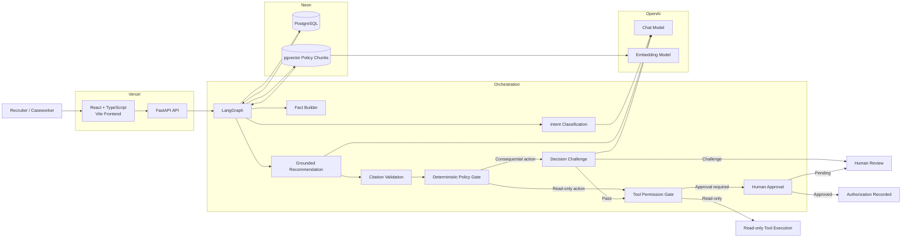
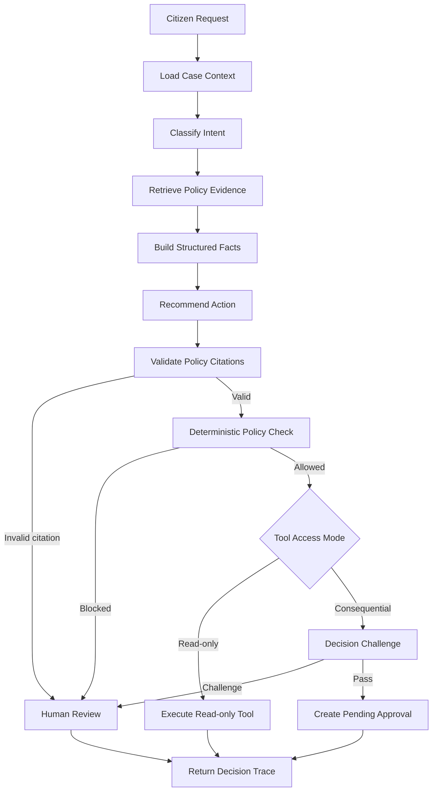
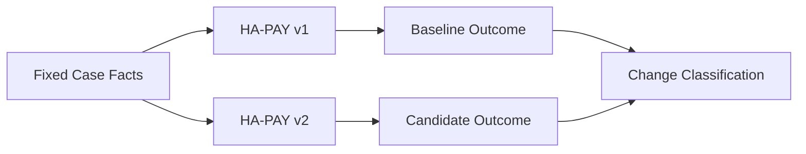
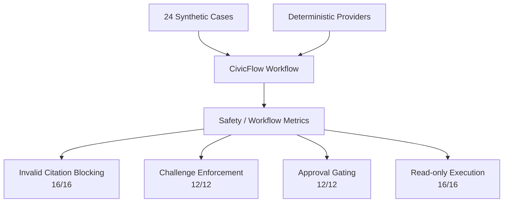
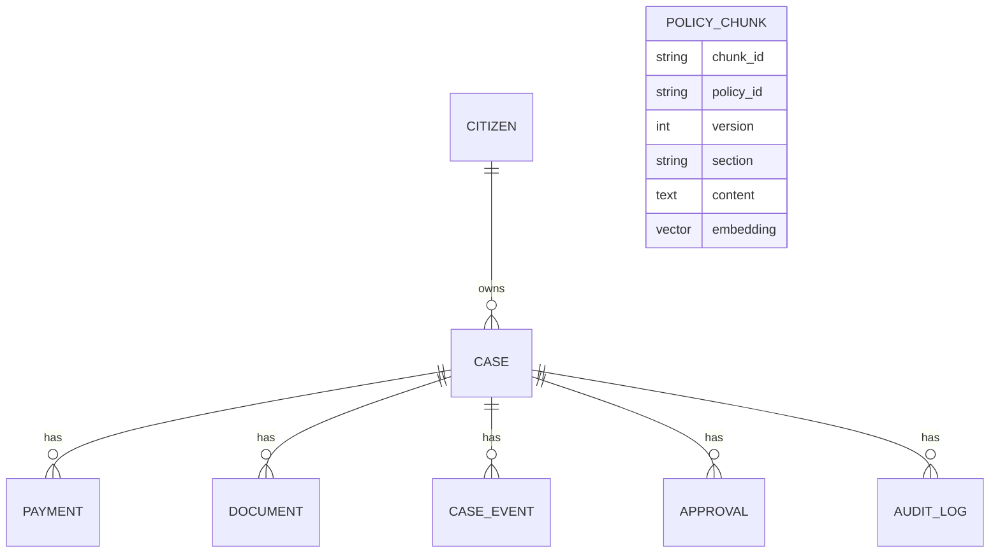

# CivicFlow Architecture

CivicFlow is a policy-aware case-management prototype designed around a simple principle:

> **A model recommendation is not authorization.**

The system separates model reasoning, policy retrieval, deterministic validation, tool permissions, challenge logic, and human approval into distinct stages.

---

## Production Architecture



---

## Analysis Workflow



---

## Why the Decision Challenge Is Separate

The primary recommendation model is asked:

```text
What action best addresses the citizen's request,
given the available case facts and retrieved policy?
```

The Decision Challenge is asked a different question:

```text
What could make this consequential recommendation
unsafe, premature, unsupported, or inconsistent
with policy?
```

This separation lets CivicFlow preserve useful recommendations without allowing the first model call to authorize its own action.

The challenge can identify:

- missing timing evidence,
- unsupported assumptions,
- verification requirements,
- contradictory policy language,
- missing case facts,
- or premature state changes.

---

## Fact Separation

CivicFlow intentionally distinguishes between recommendation facts and challenge facts.

### Recommendation facts

The recommendation stage receives structured case facts such as:

- case status,
- payment state,
- payment scheduled date,
- document review status,
- and retrieved policy evidence.

### Challenge facts

The challenge stage receives those facts plus relevant case-history events.

That allows the challenge to use richer timing and verification history without changing the recommendation behavior.

---

## Tool Safety Model

CivicFlow tools are registered with metadata such as:

```text
action
access_mode
requires_approval
handler
```

### Read-only example

`check_payment`

```text
access_mode = read_only
requires_approval = false
```

Eligible read-only actions can execute without the Decision Challenge or human approval.

### Consequential example

`open_investigation`

```text
access_mode = state_changing
requires_approval = true
```

Consequential actions must pass the Decision Challenge and stop at a human approval gate.

---

## Policy Retrieval

Policy documents are:

1. loaded,
2. split into policy chunks,
3. embedded,
4. stored in PostgreSQL with `pgvector`,
5. retrieved semantically for a citizen request,
6. passed to the recommendation model,
7. and citation-validated before execution can continue.

Representative policy evidence:

```text
HA-PAY v1
├── 4.1 Payment Schedule
├── 4.2 Missing Payments
└── 4.4 Payment Investigation
```

The model may cite only chunk IDs returned by the retriever.

---

## Policy Replay

Policy Replay intentionally does not use the LLM.

It takes:

```text
same case facts
+
baseline policy version
+
candidate policy version
```

and evaluates both versions deterministically.



Current change classifications include:

- unchanged,
- newly blocked,
- newly allowed.

This helps distinguish **policy impact** from model drift.

---

## Evaluation Architecture

The evaluation suite is deliberately deterministic.

It uses synthetic cases and controlled providers to test CivicFlow's control flow independently of live-model randomness.



Total deterministic control checks:

```text
56 / 56
```

These results do not claim that the live LLM is 100% accurate.

---

## Data Layer

Core synthetic entities:



Neon hosts:

- structured case data,
- approvals,
- events,
- audit records,
- and vectorized policy chunks.

---

## Live Deployment

```text
Browser
  ↓
Vercel — React / Vite
  ↓
Vercel — FastAPI
  ├── OpenAI — classification / recommendation / challenge
  ├── OpenAI — embeddings
  └── Neon — PostgreSQL + pgvector
```

Public endpoints:

- Frontend: https://civicflow-wkvj.vercel.app
- API: https://civicflow-api.vercel.app
- Swagger: https://civicflow-api.vercel.app/docs

---

## Current Scope Boundary

The current prototype records human authorization for consequential actions but does not implement the post-approval state-changing `open_investigation` tool handler.

That boundary is deliberate in the current portfolio version: the project demonstrates policy-aware recommendation, safety controls, and authorization without presenting an unimplemented downstream operational workflow as complete.
